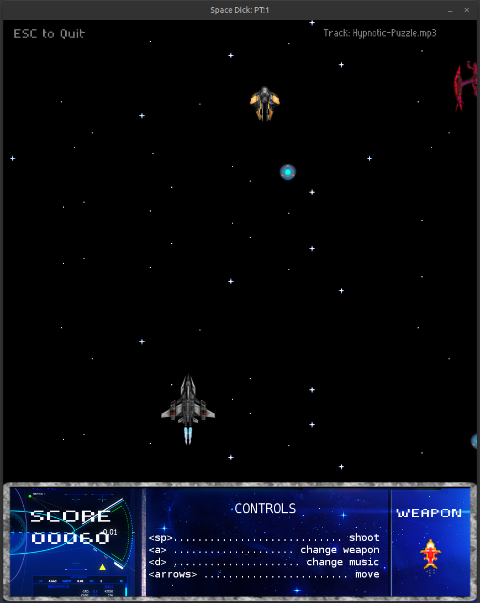

# Space Dude



## About

This is a Gosu game, forked from vvvv

## Original author

Iván González, *a.k.a* [dreamingechoes](https://github.com/dreamingechoes)

## Install dependencies

Here are the pre-requisites to play this game (or be able to use Gosu):

* Mac OS X: [Getting Started on OS X](https://github.com/gosu/gosu/wiki/Getting-Started-on-OS-X#prerequisites)
* Linux: [Getting Started on Linux](https://github.com/gosu/gosu/wiki/Getting-Started-on-Linux#getting-started-on-linux)
* Windows: [Getting Started on Windows](https://github.com/gosu/gosu/wiki/Getting-Started-on-Windows#getting-started-on-windows)

## Getting Started

To start playing this game:

* Install Ruby version 2.2.2 (using [RVM](https://github.com/rvm/rvm) or [RBenv](https://github.com/sstephenson/rbenv) or whatever).

* Clone the repo and do the ***bundle install*** thing:

```sh
user@computer:~$ git clone git@github.com:dreamingechoes/simplelogica_the_game.git
user@computer:~$ cd simplelogica_the_game
user@computer:/simplelogica_the_game$ bundle install
```

## Usage

Simply go to the game folder, and type `bin/space_dude` to start playing, like this:

```sh
user@computer:~$ cd space_dude
user@computer:~$ chmod +x bin/space_dude
user@computer:~$ bin/space_dude
```


## License

Released under the [MIT License](http://www.opensource.org/licenses/MIT).
